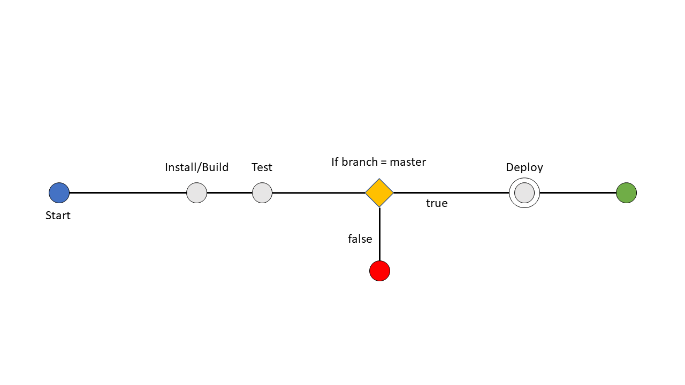

Continuous Integration Report
=========

## Integration System

  I choose to use Travis to perform the continuous integration of this npm module.

## How does it work ?

  For each push or pull/merge request of the library on Github Travis installs, tests on virtual machines. It deploys our code on npm only if we are on the master branch.

## Versioning

  Before each push or pull/merge request you need to update the version with "npm version major|minor|patch" in order to have a new release for the publication on npm.

## Pipeline

  

  First Travis install the library using git ("git clone") and its dependencies using npm ("npm install" with the package.json file). Then, it tests the library using mocha ("npm test"). Finally it deploys our library on npm ("npm publish") with a new patch ("npm version patch") only if we are on the master branch.
